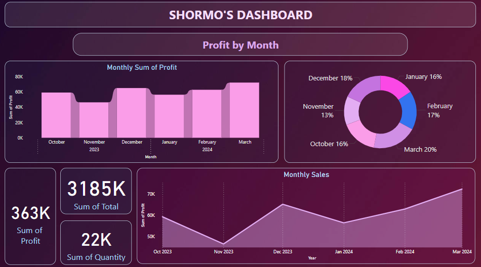
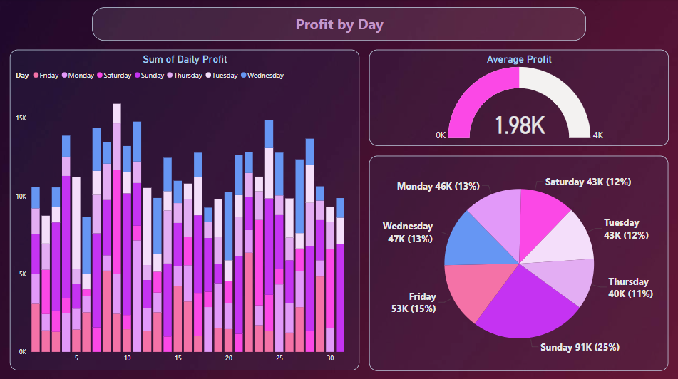
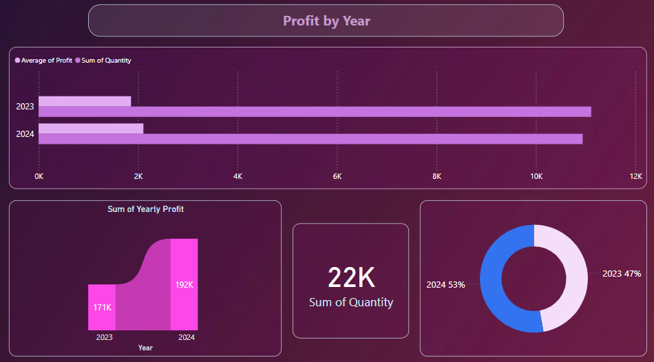
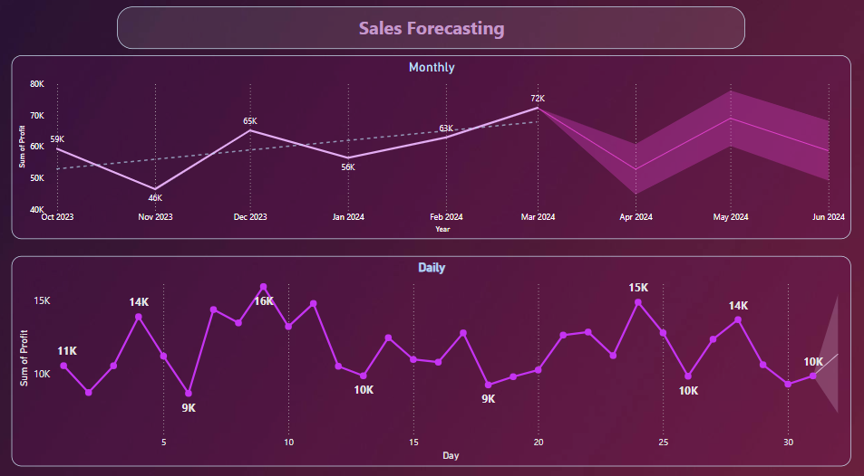
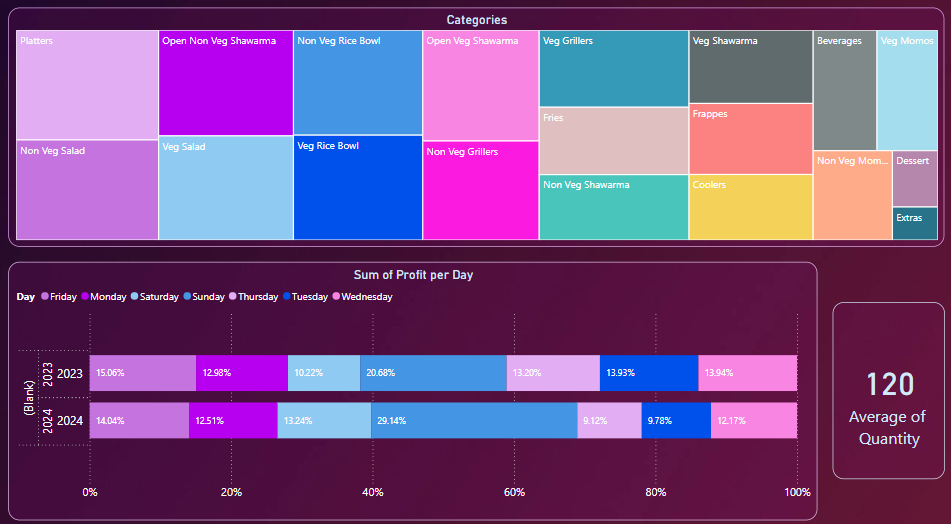

**Shawarma Sales Forecast Analysis**
 This analysis uses past sales data to predict future shawarma sales, helping improve sales and efficiency with Power BI’s tools like charts, trends, and forecasts.
 The analysis is done using PowerBI Desktop.

**OBJECTIVE:**
The goal is to study and predict Shawarma sales to make better decisions about stocking ingredients, planning promotions, and managing resources to increase profits.

**DATASET DESCRIPTION:**
1. **Menu Dataset (Menu.csv)**:
Contains information about the Shawarma items available, including:
The menu data includes details about Shawarma items, such as:
Item ID: A unique number for menu items.
Name: Name of menu items.
Category: Types of Shawarma.
Price: Price per Shawarma unit.

2. **Sales Data (Sales_data.csv)**:
Tracks record of daily or regular sales transactions:
Transaction ID: Unique number for each sale.
Date: Transaction date.
Item ID: Corresponds to menu items.
Quantity Sold: Number of units sold.
Revenue: Total revenue generated.

3. **Dashboard File (ShawarmaForecast.pbix)**:
Power BI file designed to visualize and interact with data insights, including:
Sales trends.
Forecast models for future Shawarma demand.
Performance metrics by menu item.

**DATA ANALYSIS:**
1. **Exploratory Data Analysis (EDA)**:
Analyze sales trends over time (daily, weekly, and monthly).
Identify top-selling Shawarma items.
Examine price impact on sales.

2. **Key Metrics**:
Total Revenue: Total earnings over the period.
Average Revenue Per Sale: Insight into upselling or bundling effectiveness.
Revenue Growth Rate: Month-over-month or year-over-year growth.

3. **Forecasting**:
Use historical data to predict future sales trends.
Break down sales patterns to see seasonal trends, like busy or slow times.

**Dashboard Features**
Revenue Trends: A line chart showing how earnings change over time.
Sales Forecast: A line chart predicting future sales with a range of possible outcomes.
Item Insights: A pie chart showing how much each item contributes to earnings.
Custom Filters: Options to filter data by date, item type for detailed views.

**Here are screenshots of the project:**

